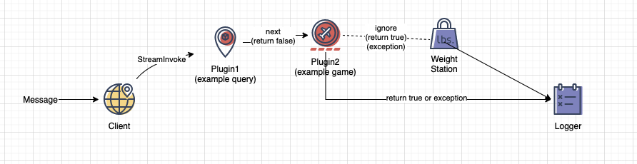
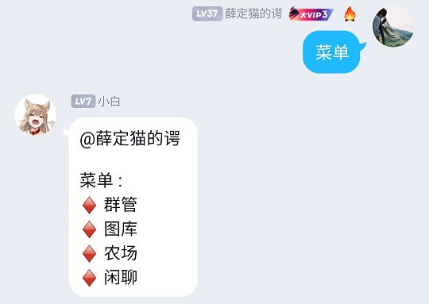
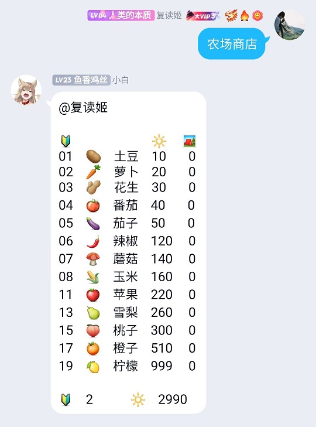
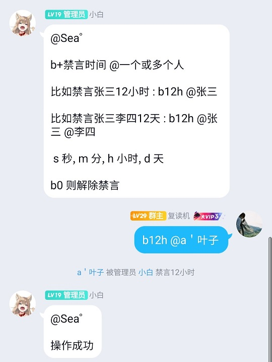
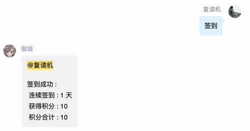
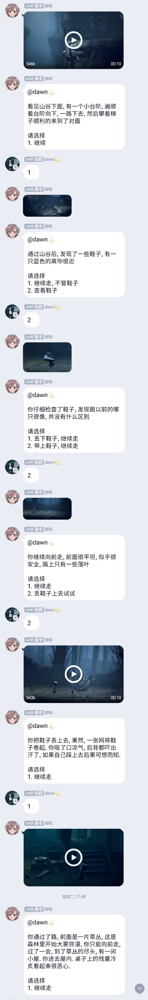

mirai-bot
=====
一个基于MiraiFramework的QQ机器人

PS: 已经跟随MiraiGo升级到 go1.18

# 设计思路

[MiraiFramework](https://github.com/niuhuan/mirai-framework)

所有的功能都是由插件完成, 事件发生时, 调度器对插件循环调用, 插件响应是否处理该事件, 直至有插件响应事件, 插件发生异常, 或插件轮训结束, 最后日志结果被记录, 事件响应周期结束。

# 运行须知

1. 第一次运行 会生成 mirai.yml 和 device.json, 将机器人的账号和密码的MD5填入 mirai.yml 中.
2. 本bot使用了redis和mongo, mongo和redis官网下载, 解压后可直接使用, 如果您没有条件下载, 可以删除database包以及需要数据库的plugins之后启动.

- (OPTIONAL) 第一次登录 您可以安装安卓软件DeviceInfo, 参照内容修改device.json, 并将protocol改为2(安卓手表)/1(安卓手机)将绕过设备锁

依赖关系
- 圈子插件 : mongo / redis
- 农场插件 : mongo / redis

# 功能展示

## 模版功能

### 菜单

#### 农场

### 图库

### 群管

### 圈子

签到, 打劫, 或者兑换成其他游戏的货币

## 其他利用此模版实现的功能

### 视频互动冒险

### 定时通知或2019新冠疫情播报

