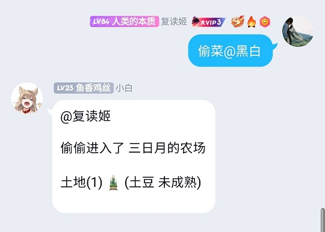

mirai-bot
=====
一个基于MariGo+MiraiFramework的QQ机器人, 完全插件化的设计, 帮您轻而易举的建立属于自己的机器人, 对其增改插件, 同时保持更为清晰的代码结构


# 设计思路

所有的功能都是由插件完成, 事件发生时, 调度器对插件循环调用, 插件响应是否处理该事件, 直至有插件响应事件, 插件发生异常, 或插件轮训结束, 最后日志结果被记录, 事件响应周期结束。


## 插件

- Id 插件的ID
- Name 插件的名称
- OnPrivateMessage 收到私聊消息时
- OnGroupMessage 收到组群消息时
- OnTempMessage 收到临时消息时
- OnMessage 收到消息时, 优先级低于明确类型的Message
- OnNewFriendRequest 收到好友请求时
- OnNewFriendAdded 添加了好友时
- OnGroupInvited 收到组群邀请时
- OnJoinGroup 加入组群时
- OnLeaveGroup 离开组群时

## 动作监听器

- Id 监听器的ID
- Name 监听器的名称
- OnSendPrivateMessage 发送了私聊消息将会执行回调
- OnSendGroupMessage 发送了组群消息将会执行回调
- OnSendTempMessage 发送了私聊消息将会执行回调

# 实现一个插件超级简单
```
func NewPluginInstance(customerPlugins []*client.Plugin) *client.Plugin {
	return &client.Plugin{
		Id: func() string {
			return "MENU"
		},
		Name: func() string {
			return "菜单"
		},
		OnMessage: func(client *client.Client, messageInterface interface{}) bool {
			content := client.MessageContent(messageInterface)
			if strings.EqualFold("菜单", content) {
				builder := strings.Builder{}
				builder.WriteString("菜单 : ")
				for i := 0; i < len(customerPlugins); i++ {
					builder.WriteString(fmt.Sprintf("\n♦️ %s", (*customerPlugins[i]).Name()))
				}
				client.ReplyText(messageInterface, builder.String())
				return true
			}
			return false
		},
	}
}
```

# 功能展示





